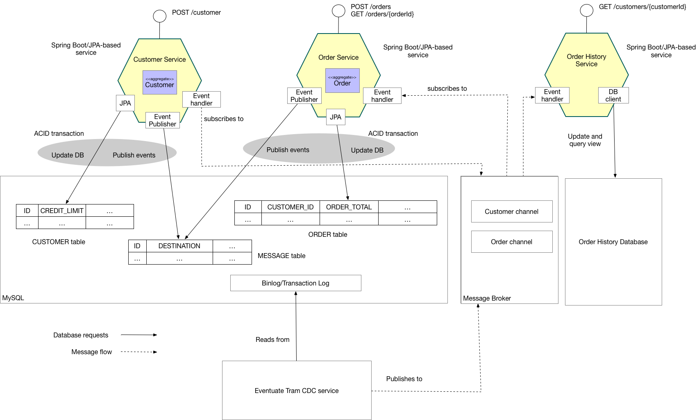

# Eventuate Tram Customers and Orders

This application  demonstrates how to maintain data consistency in an Java/JDBC/JPA-base microservice architecture using http://microservices.io/patterns/data/saga.html[sagas].
It's a choreography-based saga version of https://github.com/eventuate-tram/eventuate-tram-sagas-examples-customers-and-orders[Eventuate Tram Sagas Customers and Orders]

The application consists of two services:

* `Customer Service` - manages customers
* `Order Service` - creates orders
* `Order History Service` - a CQRS view service that maintains a customer's order history

Both services are implemented using Spring Boot, JPA and the https://github.com/eventuate-tram/eventuate-tram-core[Eventuate Tram framework], which provides transactional publish/subscribe over https://redis.io/topics/streams-intro[Redis Streams].

The `Order Service` uses a choreography-based saga to enforce the customer's credit limit when creating orders.

== About sagas

http://microservices.io/patterns/data/saga.html[Sagas] are a mechanism for maintaining data consistency in a http://microservices.io/patterns/microservices.html[microservice architecture].
A saga is a sequence of transactions, each of which is local to a service.

There are two main ways to coordinate sagas: orchestration and choreography.
Please see https://github.com/eventuate-tram/eventuate-tram-sagas-examples-customers-and-orders[example] to learn about orchestration-based sagas.
This example uses choreography-based sagas, which use domain events for coordination.
Each step of a saga updates the local database and publishes a domain event.
The domain event is processed by an event handler, which performs the next local transaction.

To learn more about why you need sagas if you are using microservices:

* read the http://microservices.io/patterns/data/saga.html[Saga pattern]
* read about sagas in my https://microservices.io/book[Microservice patterns book]
* watch my http://microservices.io/microservices/general/2018/03/22/microxchg-sagas.html[microXchg 2018 presentation]

=== The Create Order saga

The saga for creating an `Order` consists of the follow steps:

1. The Order Service creates an `Order` in a pending state and publishes an `OrderCreated` event
2. The `Customer Service` receives the event attempts to reserve credit for that `Order`. It publishes either a `Credit Reserved` event or a `CreditLimitExceeded` event.
3. The `Order Service` receives the event and changes the state of the order to either `approved` or `rejected`.

=== About CQRS

https://microservices.io/patterns/data/cqrs.html[CQRS] is a pattern for implementing queries that retrieve data from multiple services.
A service maintains a easily queried replica of the data by subscribing to events published by services that own the data.

=== Architecture

The following diagram shows the architecture of the Customers and Orders application.



The application consists of three services:

* `Customer Service` - implements the REST endpoints for managing customers.
The service persists the `Customer` JPA entity in a MySQL/Postgres database.
Using `Eventuate Tram`, it publishes `Customer` domain events that are consumed by the `Order Service` and the `Order History Service`.

* `Order Service` - implements RESTs endpoint for managing orders.
The service persists the `Order` JPA entity in MySQL/Postgres database.
Using `Eventuate Tram`, it publishes `Order` domain events that are consumed by the `Customer Service` and the `Order History Service`.

* `Order History Service` - a CQRS view service that maintains a customer's order history in Redis.
It provides a REST endpoint for retrieving the order history.

There is also:

* `Message Broker` - Redis Streams

* `Order History Database` - Redis

A service publishes events using Eventuate Tram.
Eventuate Tram inserts events into the `MESSAGE` table as part of the ACID transaction that updates the JPA entity.
The Eventuate Tram CDC service tracks inserts into the `MESSAGE` table using the MySQL binlog and publishes messages to the message broker, which in this example is Redis (Streams).
A service subscribes to the events and updates its JPA entities in response.

== Building and running

Note: you do not need to install Gradle since it will be downloaded automatically.
You just need to have Java 8 installed.

Build and launch the services using https://docs.docker.com/compose/[Docker Compose]:

If the containers aren't accessible via `localhost` - e.g. you are using Docker Toolbox, you will have to use `${DOCKER_HOST_IP}` instead of localhost.
See this http://eventuate.io/docs/usingdocker.html[guide to setting `DOCKER_HOST_IP`] for more information.

```
docker-compose composeUp
```

== Using the application

Once the application has started, you can use the application via the Swagger UI:

* `Customer Service` - `http://localhost:8081/swagger-ui/index.html`
* `Order Service` - `http://localhost:8082/swagger-ui/index.html`
* `Order History Service` - `http://localhost:8083/swagger-ui/index.html`

You can also use `curl` to interact with the services.
First, let's create a customer:

```bash
$ curl -X POST --header "Content-Type: application/json" -d '{
  "creditLimit": {
    "amount": 5
  },
  "name": "Jane Doe"
}' http://localhost:8082/customers

HTTP/1.1 200
Content-Type: application/json;charset=UTF-8

{
  "customerId": 1
}
```

Next, create an order:

```bash
$ curl -X POST --header "Content-Type: application/json" -d '{
  "customerId": 1,
  "orderTotal": {
    "amount": 4
  }
}' http://localhost:8081/orders

HTTP/1.1 200
Content-Type: application/json;charset=UTF-8

{
  "orderId": 1
}

```

Finally, check the status of the `Order`:

```bash
$ curl -X GET http://localhost:8081/orders/1

HTTP/1.1 200
Content-Type: application/json;charset=UTF-8

{
  "orderId": 1,
  "orderState": "APPROVED"
}
```

== Got questions?

Don't hesitate to create an issue or see

* https://groups.google.com/d/forum/eventuate-users[Mailing list]
* https://join.slack.com/t/eventuate-users/shared_invite/enQtNTM4NjE0OTMzMDQ3LWJlZDJjNzc3M2NjYjZmOTdhMGE3ODM1NmFjM2RmNjViM2Y5ZjJjZmNiZDVhMGVlOTE5NGNkOTAwNWI4YWE4OTA[Slack Workspace]
* http://eventuate.io/contact.html[Contact us].
